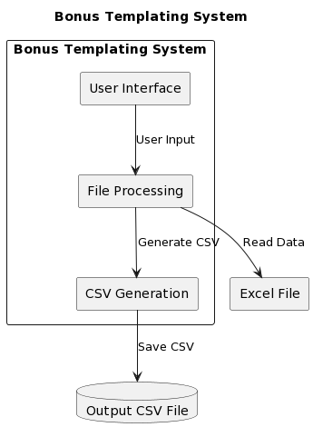

# Bonus Templating System (An Internal Excel Automation Tool) Documentation

## Overview
The Bonus Templating System is a Streamlit application that allows users to process data from an Excel file and generate a CSV file based on the selected bonus type. The generated CSV file can be downloaded by the user.

The application is written in Python and utilizes the following libraries:
- Streamlit (v1.24.0) - A framework for building interactive web applications with Python.
- openpyxl (v3.1.2) - A library for reading and writing Excel files.
- pandas (v2.0.3) - A powerful data manipulation and analysis library.

## Installation
To run the Bonus Templating System, make sure you have Python 3.x installed on your system. Then follow these steps:

1. Clone the project repository from GitHub to your local machine.
2. Navigate to the project directory: `cd bonus-templating-system`
3. Install the required Python dependencies using pip: `pip install -r requirements.txt`
4. Run the application: `streamlit run excel-automation.py`

This will start the Streamlit development server...

## Usage
Upon running the application, you will be presented with a web interface to interact with the Bonus Templating System. The interface consists of several input fields and a process button.

### Input Fields
1. **Source File**: Use the file uploader to select an Excel file (.xlsx or .xls) containing the source data. The selected file will be processed by the application.

2. **Bonus Type**: Select the type of bonus from the dropdown list. The available options are:
   - Free Bets
   - Free Spins
   - Casino Bonus
   - Sports Bonus
   - Prize Picker

3. **Bonus Code**: Enter the bonus code for the selected bonus type. This code will be used in the generated CSV file name.

4. **Name**: Enter the name associated with the bonus. This name will also be included in the generated CSV file name.

5. **Platform**: Select the platform from the dropdown list. The available options are:
   - PBULL
   - SBULL

### Process Button
Click the "Process File" button to initiate the file processing and CSV generation. Before clicking the button, make sure all the input fields are filled in. If any field is missing, an error message will be displayed.

### Output
Once the file processing is completed successfully, a success message will be displayed, indicating that the processing is finished.

If the processing is successful and a CSV file is generated, a "Download Output File" button will appear. Clicking this button will download the generated CSV file to your local machine.

## File Processing Logic
The `process_file()` function is responsible for processing the source file and generating the output CSV file. Let's go through the logic step by step:

1. Open the source file using `openpyxl.load_workbook()` and get the active sheet.

2. Determine the starting row based on the data type in cells A1 and B1. If either cell contains a string, the starting row is set to 2; otherwise, it is set to 1.

3. Retrieve the values in columns A and B from the source file, starting from the determined row, using `source_sheet.iter_rows()`.

4. Prepare the output file name based on the bonus code, name, and platform. The file name format is "{bonus_code}_{name}_{platform}.csv".

5. Determine the header based on the selected bonus type. The header varies depending on the bonus type.

6. Create a pandas DataFrame from the retrieved rows, using the header as column names.

7. Save the DataFrame to a CSV file using `df.to_csv()`.

8. Close the source workbook.

9. If the file processing completes without any exceptions, a success message is displayed, indicating the successful completion.

10. If any exception occurs during the file processing, an error message is displayed with the details of the error.

## Additional Information
The Bonus Templating System UI provides 10 blank lines after the file processing section, which can be used for additional content or separation.

The application also displays hyperlinks to the developer's LinkedIn and GitHub profiles for development and support-related inquiries.

The diagram was created with a PlantUML Script [PlantUML Script](https://plantuml.com/)

## Development and Support
Your contributions are welcome!

